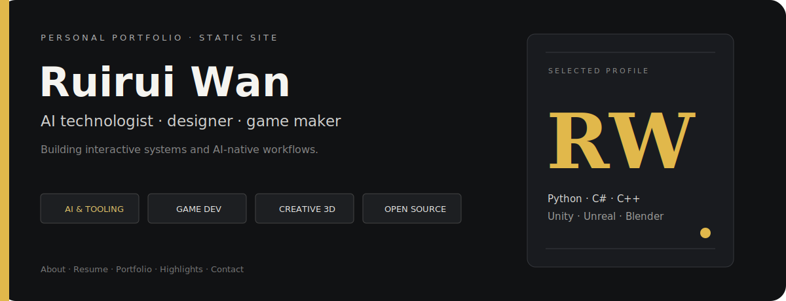

<p align="center">
  
</p>

# Ruirui Wan — Portfolio

A lightweight static portfolio for **Ruirui Wan**, presenting AI-native workflow work, game and interaction design, open-source activity, education, and direct contact paths.

## Live layout proof

<p align="center">
  
  
</p>

## What the site contains

- **About** — multidisciplinary AI, design, and creative-systems profile.
- **Resume** — education, startup / technical experience, and core disciplines.
- **Portfolio** — filterable AI tooling, game development, and open-source cards.
- **Highlights** — selected themes across AI workflows, engines, and collaboration.
- **Contact** — GitHub, two email links, map embed, and a mail-client form.

The profile currently names Python, C#, C++, Unity, Unreal Engine, Blender, and open-source contributions including `oh-my-open-code`, `repo-prompt`, and Endless Sky. These are authored claims in `index.html`; this README does not add external adoption or impact claims.

## Run locally

No build step is required.

```bash
python3 -m http.server 4173
```

Open <http://127.0.0.1:4173>.

The page uses local HTML / CSS / JavaScript plus remote Google Fonts and Ionicons. Without internet access, core content still loads, but the remote font and icons may fall back or disappear.

## Repository map

```text
index.html              site content and sections
assets/css/style.css    responsive visual system
assets/js/script.js     navigation, filters, modal, form state
assets/images/          profile, project, and UI imagery
website-demo-image/     checked-in desktop / mobile previews
```

`index.txt` is the original template content snapshot, not the current site copy; use `index.html` as the product source of truth.

## Publish with GitHub Pages

1. In repository **Settings → Pages**, choose **Deploy from a branch**.
2. Select the branch containing this site and the `/(root)` folder.
3. After deployment, verify deep links, remote assets, contact actions, and both desktop / mobile layouts.

Because all application paths are relative (`./assets/...`), the root can also be served from a project subpath.

## Release checklist

- `index.html` and every local asset path return successfully.
- About / Resume / Portfolio / Highlights / Contact navigation works.
- Project filters and testimonial modal remain keyboard / pointer usable.
- Email links open the user's configured mail client; the form uses `mailto:` rather than a backend.
- Mobile sidebar and bottom navigation do not cover content.

## License

MIT, inherited from the original `vcard-personal-portfolio` template. See [`LICENSE`](LICENSE) for the copyright notice and terms.
